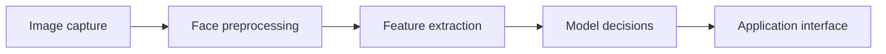
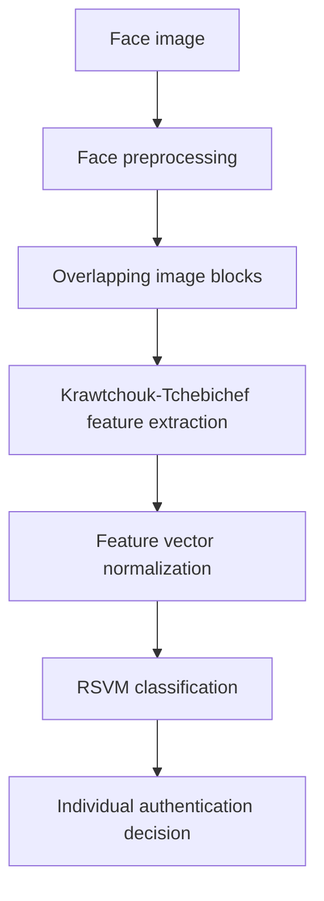
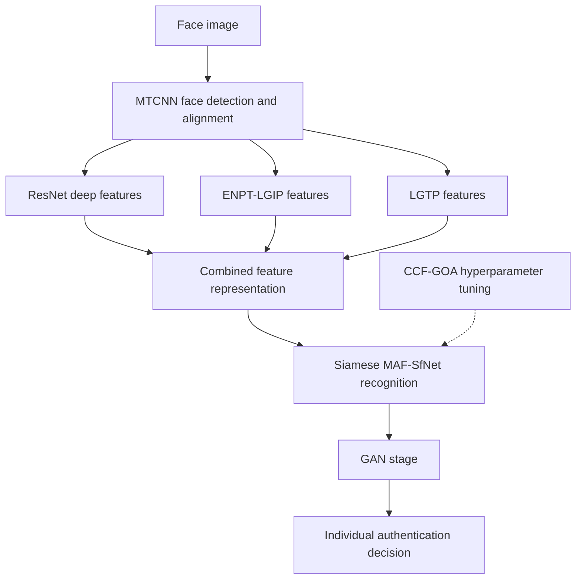
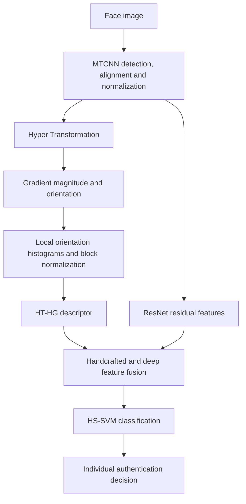
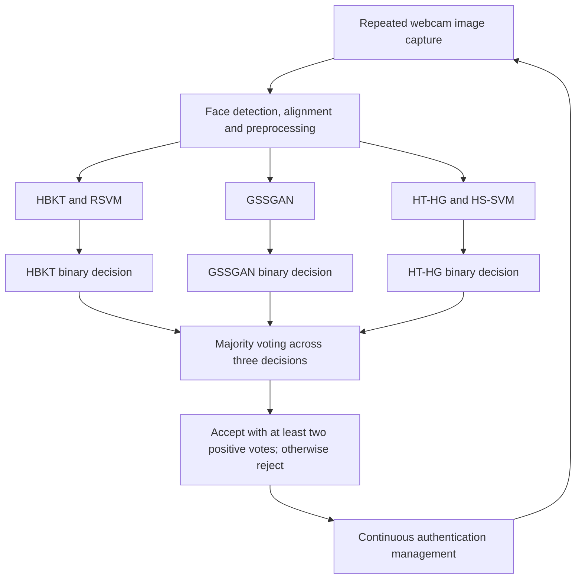

# Bhanukiran Devisetty

## Python and computer vision research

My work includes Python applications for face recognition and authentication, and research pipelines for evaluating face-verification models. This portfolio describes two related project areas. Implementation repositories are private.

### Continuous Face Recognition and Authentication

A research prototype combining image capture, face preprocessing, feature extraction, model decisions and a graphical interface. The work explores individual recognizers and ensemble decisions in an authentication workflow.

### Leakage-Controlled Multi-Model Face Verification

A research workflow for comparing heterogeneous face representations under subject-disjoint evaluation. It includes model comparison, fusion experiments and reproducibility records, with separate training, validation and testing responsibilities.

### Dissertation method flowcharts

These conceptual flowcharts summarize the architectures described in dissertation Chapters 3-6. They describe the dissertation methods; they do not assert that every archived implementation reproduces every component or that the systems have been independently validated.

#### HBKT with RSVM

Chapter 3 combines block-based Krawtchouk-Tchebichef features with RSVM classification.

#### GSSGAN

Chapter 4 describes complementary facial features followed by the MAF-SfNet recognition architecture, CCF-GOA hyperparameter tuning and a GAN stage. The tuning connection represents model development rather than a required operation on every captured frame.

#### HT-HG with HS-SVM

Chapter 5 combines the HT-HG descriptor with ResNet features before HS-SVM classification.

#### Combined dissertation ensemble

Chapter 6 sends the same preprocessed face to three independent recognition modules. Each produces a binary decision. The final decision accepts the enrolled identity when at least two of the three modules vote to accept; otherwise it rejects. Repeated decisions feed continuous authentication management.

The separate journal verification study evaluates score-fusion alternatives, including mean-score fusion. That is a different protocol from the dissertation's final majority-vote ensemble shown here.

### Engineering focus

- Modular Python applications and graphical interfaces
- Feature extraction, classification and model evaluation
- Experimental configuration, result tracking and technical documentation

These diagrams summarize software workflows and contain no implementation details or biometric data. Research prototypes are not presented as independently validated production authentication systems. No performance or security guarantee is asserted here.
